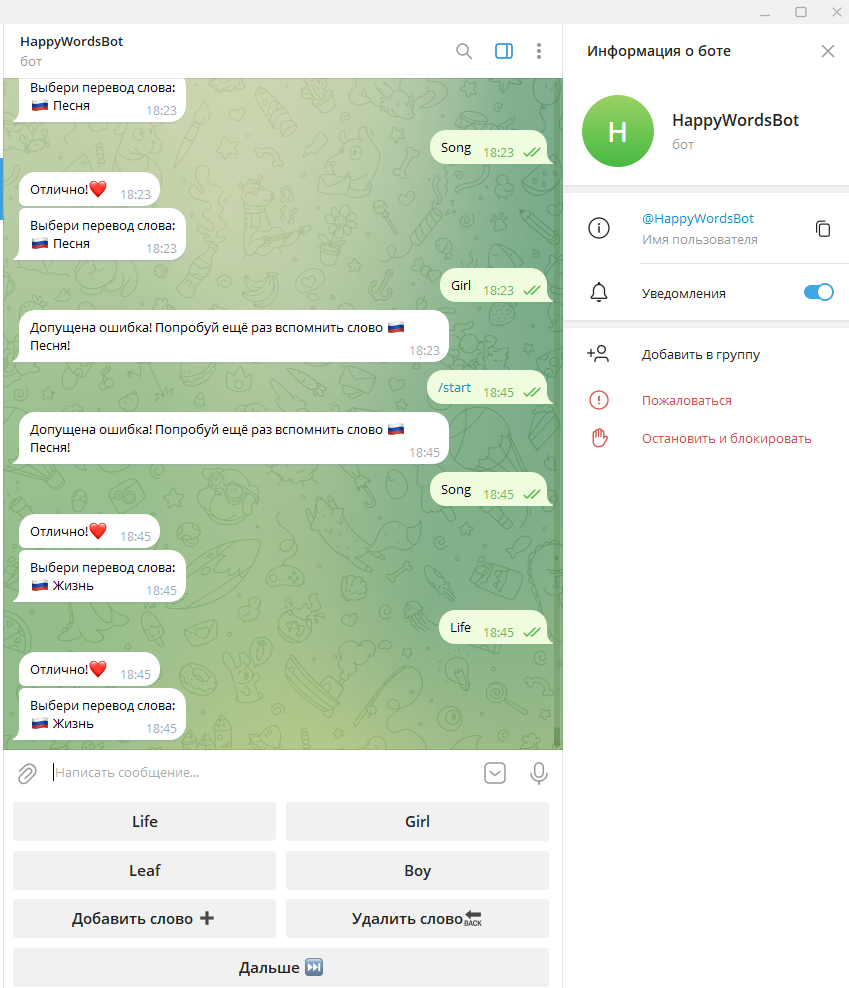

# Telegram Бот 
## для изучения ангрийского языка.

### Основой функционал.

1. Бот позволяет изучать английские слова. 
2. После включения /start Бот спрашивает слова на русском языке и предлагает 4 варианта ответа на английском.
3. При правильном ответе подтверждает ответ, при неправильном - предлагает попробовать снова.
4. Имеет возможность добавлять свои собственные слова, которые доступны только Вам.
5. Свои слова можно также удалять.
6. Данные хранит в своей базе данных под Postgresql.
7. Работа с Бото начинается после приветственного сообщения.